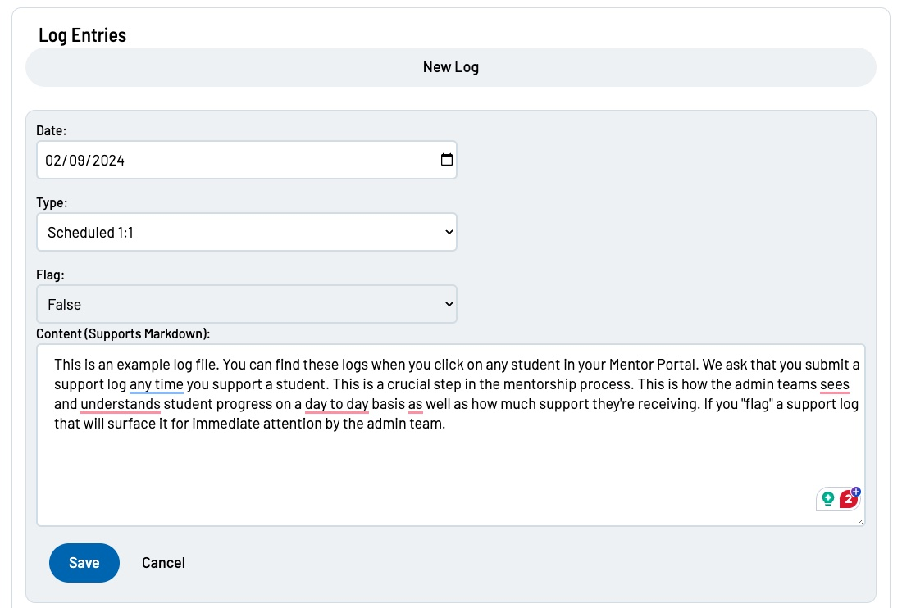
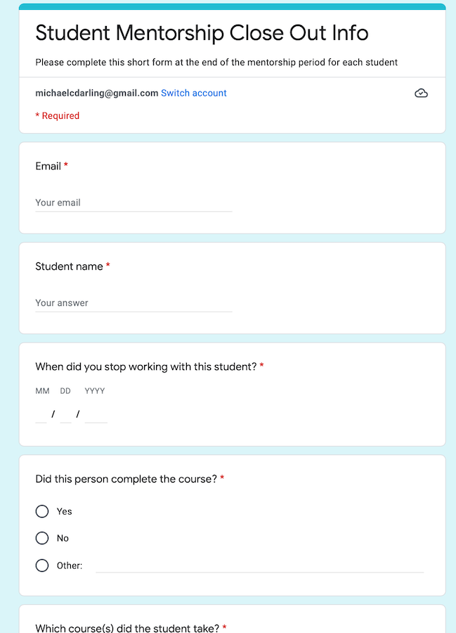

# CodingNomads Mentorship Process

This document contains a breakdown of the logistics surrounding our mentorship process, with links to other documents that have in-depth descriptions.

[TOC]

## Starting To Work With A Student

After you've become a part of our mentor community, we will want to connect you with students. This happens as follows:

1. **Availability**: We reach out to you to see if you're available to take on a new student.
2. **Student Info**: Once you accept, we'll send you the student's background info.
3. **First Contact**: We send a shared email to both you and your student, to establish the initial contact. We will also create a dedicated Discord channel for you and your mentee. After we share an introduction, please respond at your earliest convenience rather than waiting for the student to respond. Our goal is to be proactively helpful and ready.
4. **First Call**: You reach out to your student to schedule your first call, which is a full-time mentor call. Please send a calendar invite to the student and calendar@codingnomads.co, and the contact method you'll use to get in touch. [Calendly](https://calendly.com/) is a useful tool to help you find a common time slot.
5. **Recurring Weekly Call**: During your first call, you will schedule your [standing weekly 1-on-1 call](03_mentorship_process.md#core-duty-2-weekly-1-on-1-calls) with your student.

### First Call

**Preparation**: Before your first call, ask the students to make as much progress on the beginning sections of the course (machine setup etc.) as possible. This will make your first meeting more productive - a great way for the student to kick off!

**Introduction**: Since this will be the first time that you and your student meet face-to-face, take 10-15 minutes  to get to know them and discuss their goals and expectations for the course. Setting clear expectations as well as clearly knowing _why_ the student is taking the course is helpful for themselves, as well as for you, in order to better keep them accountable.

**Screen-Sharing**: Next dive right into letting them share their screen. Make sure they’ve got everything installed correctly, IDE downloaded, labs open in the IDE and able to run applications and push their work to GitHub. Help them fix what might still be missing. If there is extra time, go further into using Git or getting cozy working with their IDE.

- [Student Support Checklist](08_checklist.md)

## CORE DUTY #1: Make Your Support Felt

Our students need to know that **you are with them and care about their progress**:

- **Reach out to them regularly** to ask how things are going
- Stay up-to-date with their **progress** using their [Outline Report](05_tools.md#progress-check-ins-with-the-learning-platform)
- **Share** an interesting link with them

We want each of our mentors to **make every student feel truly supported**. If possible, think of your students more as friends rather than sticking to a stiff, formal student-teacher relationship.

Like good friends, we want students to feel that we are here for them when they need us. Laughter and friendship go a long way in making sure the learning process is fun!

### Get To Know Your Student

Use your first call to ask them about themselves. Tell them a little bit about yourself as well. Getting to know each other and exchanging personal thoughts is often nicer on a video call than in writing.

We will also provide a log file with info and notes about your student. Please add a brief, ~1-2 sentence, entry to the log after every call.  It helps to keep track of their progress, motivations, and concerns. The log file is a good place to document the student's goals from week-to-week.  

It is also helpful to work with your student to develop a rough timeline for completing their coursework. Ask them how many hours per week they are able to dedicate to the course and help them set expectations for themselves (while remaining flexible).  The optimistic "pushing hard" timeline for most courses is to work an average of 15 hours per week and finish in 12 weeks.  You can check with the course creator or experienced mentors for insight on how long it takes students to finish particular modules, or the course in general.

### Answer Discord Questions

Prompt your students to post to, answer, and discuss on the [CodingNomads Discord](http://codingnomads.com/discord). We want to promote our Discord server as a helpful and welcoming place where students and mentors interact and share knowledge.

Therefore, we welcome you to:

- Check Discord regularly
- Prompt your students to discuss questions on the forum
- Answer your students' questions
- Answer other students' questions
- Contribute interesting posts

The more information you and your students share in the public forum, the more benefit will come to the rest of our community.

### Stay Up-To-Date With Your Students' Progress

Knowing where your students are currently at, what they have succeeded to do and with what they might be struggling is important so they can feel that we care about their learning process.

Our platform offers ways to stay up-to-date with your students' progress. Here are instructions on how to find your students' progress logs. 

- [How to find your student's progress log](05_tools.md#progress-check-ins-with-the-learning-platform)

Before your call, make sure to check where your student is at. This will also help you find topics to discuss if your student doesn't have any specific questions.

### Code Review The Capstone Project

Most mentored courses include at least one larger project, called the **capstone** project. This project makes your students put the content they are learning into practice. Your responsibility as their mentor is to support them through their work on the capstone project:

- **Push** them to keep working on it and get it done.
- **Answer** question they have, and help them with finding solutions.
- Code **review** their project code thoroughly.

We suggest you to [do your code reviews on GitHub](14_tips.md#do-code-reviews-on-github), as this will additionally prepare your students for the real-world experience of receiving code reviews directly in their code on GitHub, as well as to help them practice the process associated with that.

This will be the largest project your students have worked on so far, so be patient and supportive and help them to get it done. There's nothing quite as useful and motivating as having a completed project that you built by yourself :).

#### Capstone Review Guidance

Capstone projects should be completely new and personal. Students should not reuse old example projects or code from the course material. Each line of code should be written from scratch, with intention. They'll need to clearly demonstrate comprehension of the course material, and also the ability to stand on their own.

As your student’s project begins to progress, assist them in making decisions that will benefit the quality of the project. Provide constructive feedback during weekly sessions, targeting the specific feature they are currently working on. Give the student a list of tasks to accomplish before next week’s session.

When your student believes the project is nearing “complete” and is ready for demonstration, have them share a GitHub link. This is when you’ll perform a top-to-bottom review. Take notes during each step below of any fixes or adjustments that are required.

1. Clone the repo and follow instructions in their README to get the project running.
2. Use each feature of the application, testing for functionality.
3. Conduct a thorough code review of the entire project.
4. Utilize the course-specific capstone requirements to ensure the project is up to standard:  

    - <a href='https://codingnomads.com/java-301-capstone-project-introduction' target='_blank'>Java Programming</a>
    - <a href='https://codingnomads.com/java-spring-capstone-checklist' target='_blank'>Advanced Java & Spring</a>
    - <a href='https://codingnomads.com/python-301-capstone-project-requirements' target='_blank'>Python</a>
    - <a href='https://codingnomads.com/dsml-capstone-proposal-instructions' target='_blank'>DSML</a>
    - <a href='https://codingnomads.com/report-capstone-project-deep-learning' target='_blank'>Deep Learning - UPDATE ME</a>
    - <a href='https://platform.codingnomads.co/learn/mod/page/view.php?id=8585' target='_blank'>Flask - UPDATE ME</a>
    - <a href='https://platform.codingnomads.co/learn/mod/page/view.php?id=8640' target='_blank'>Django - UPDATE ME</a>

5. Complete and submit the relevant capstone review form:  

      - <a href='https://forms.gle/WdoBvNjBFwCWwuxKA' target='_blank'>Java, Python, Spring, Flask, Django</a>  
      - DSML  

Provide your student with final constructive feedback based on your notes. Once the student makes additional changes based on this feedback, a second review is recommended - encourage them to post the project publicly on Discord for further community review.

## CORE DUTY #2: Weekly 1-On-1 Calls

Alongside with making sure your students feel supported and taken care of during their learning process, the weekly 1-on-1 calls are what constitute your core mentorship offering.  We recommend scheduling these calls for 1 hour.  We encourage you, if possible, not to schedule meetings back-to-back so that a meeting can run long if needed.  You’re also encouraged to hop on extra calls with your students if your schedule permits and you feel like text is insufficient for answering a particular question, or that that would be the best way to get your student unstuck!

- [Using Zoom for scheduling, video sessions, and recordings](05_tools.md#video-sessions-and-recordings-with-zoom)

### Set Weekly Goals Every Week

This is one of the #1 pieces of feedback we get from students. They want help setting goals and they want accountability to stick to those goals. Setting realistic goals is a process that does not happen overnight. Start by setting ambitious but achievable goals for them each week and start to scale back if you see they are regularly coming up a bit short.

### Set A Fixed Meeting Time

Schedule the 1-on-1 with your student at a **fixed recurring time every week**. Send a recurring calendar invite for your weekly meetings so it's on both your calendars.

Use your first call to lock in a time slot, then stick to it. No one enjoys the back-and-forth of trying to figure out a time, and we're aware that you have more important (and more fun) things to do with your time.

### Help Your Students Come Prepared

Calls will be more productive if both you and your student come prepared.

To make that more likely, you can:

- send an email or chat message to your student one day before your call

### Know What To Talk About

During your 1-on-1 call, you **review their labs together and discuss their code**. These labs are the content of their aforementioned submissions. “Grading” these submissions, therefore, happens in a live discussion with the student, rather than separate from the call. This allows students to ask specific questions and brings about a more organic discussion regarding their code.

- See more in [Labs & Projects](04_code_labs.md)

You will **discuss challenging concepts** from the course materials if the student has not quite gotten a grip on them yet. Interested students have interesting questions! Help them find the answers. You are there to help them get unstuck, and help them learn _how_ to get unstuck by themselves (i.e., helping them to learn how to google the right questions!).

Finally, you will help them create **study schedules**, set realistic **expectations**, and check in with them on their progress. You are there to **hold them accountable** for their plans. Help them set generous plans for themselves so that they will be able to stick to their plans.

<ins>In short, during your 1-on-1 session you should</ins>:

- **Review** labs and project code together
- **Discuss** course-related concepts
- **Answer** student questions
- **Help** them schedule and stick to their plans
- **Set Goals** - they want goals and accountability

### Recording Video Calls

Encourage students to **screen-record your 1-on-1 calls**. Having their mentor session recorded is useful for the students because then they can refer back to the video afterward.

Students can thereby re-watch helpful parts of a meeting. Some students will be more relaxed during the call since they know they can always come back and check if they think they missed something. 

### Submit Support Logs

Any time you support your student we ask you to add a brief entry into the students log file. 

## Weekly Mentor Standup

Every Friday, we ask you to complete a quick form. In this form you'll check in about this week's mentorship. You can raise concerns regarding a student's progress, so we can help and intervene quickly, if necessary.

<ins>Please make sure to submit this form every week</ins>:

- [Weekly Mentor Standup](https://docs.google.com/forms/d/e/1FAIpQLSdZEKcxX9ZYE-M1P8xZ8Wuipkt2W2lE1ArtZCUUO6z1pOtuRA/viewform)

## Time Tracking With TopTracker

To keep track of the time you spend on mentoring your students, please use the TopTracker time tracker. TopTracker is easy to use and makes time tracking (nearly) effortless. We will use your TopTracker-recorded time to calculate your payment each month.

- [How to use TopTracker for CodingNomads time tracking](05_tools.md)

## Wrap Up Working With A Student

When you student progresses well through the course, they will eventually reach the end and graduate.  At this time, please fill out the student close-out form.  

Please also fill out the form in the unfortunate event that the student drops out.

### Progress Notifications

So that the management team can stay up-to-date with our students' progress, we ask you to send us a couple of progress updates throughout each student's course journey:

- **50% Complete**: Send a chat message or email to the admin team when your student is about halfway through the course. This is not an exact marker point, but an approximation.
- **Capstone Started**: Inform us when your student has started working on their capstone project (chat message or email)
- **Capstone Reviewed**: Once your student has finished their capstone project and you have reviewed and approved their code on GitHub, send us the final progress notification per chat message or email. This message should reach us before your final call with the student. Receiving this information from you is extremely important, so that we can commence the close-out process for that student.

### The Final Call

After [reviewing your student's capstone project code](#code-review-the-capstone-project) and **letting us know** that they have completed the course, you'll go on a final close-out call with your student. Similar to your intro call, this call will be a little different than your other 1:1s. Here are some helpful tips to keep in mind:

- **It's The End**: Clearly state to your student that the upcoming call will be your final call. This gives them a chance to revisit topics and assemble some questions that might still linger on their minds.
- **Request Certificate**: Each course includes a Google form at the end that students can submit to request their completion certificate. Encourage them to fill this form if you assess that they have put in the work and completed the course.
- **Give Pointers**: By the time your final call comes around, you will know your student's interests well, so you're encouraged to provide them with tips and suggestions on how to continue their learning journey following their interests.
- **Ask For Satisfaction**: Ask your student if there is anything we can do to make them completely satisfied with our service. We want to provide great mentorship and we want our students to be happy and satisfied. If they have feedback and wishes, let them know we'll do our best and pass on their suggestions to us.
- **Ask For Reviews**: Reviews are important to help others discover and trust our mentoring services. Ask your student to leave us a review on [SwitchUp](https://www.switchup.org/bootcamps/codingnomads) and [CourseReport](https://www.coursereport.com/schools/codingnomads). They can write one and copy-paste to the other service. This is extremely helpful for getting the word out and building trust for our future students.
- **Point To Our Community**: Re-iterate that alumni of our courses are very welcome to keep asking and answering questions on [Discord](https://codingnomads.com/discord) and our chat community. They can keep reaching out to us and other students. We would love for them to be an active part of the CodingNomads community.

Please make sure to encourage your student to submit the Google form to request a certificate of completion, if you assess that they have put in the work and completed the course. **Let us know** over chat or email that your student is ready to graduate! 🎉

## Troubleshooting

Check out our [FAQ page](09_faq.md).  Feel free to reach out to Michael or anyone in the management team!

## Mentor Support And Questions

If anything regarding the mentorship process is unclear and isn't covered by this document, or if something else went wrong that you need to talk to someone about directly, please feel free to reach out on Discord to me (@Michael) or Ryan (@Ryan Desmond) or on email: , .

If you have questions in regards to your payment, or the payment process in general, please reach out to .

- **Mentorship Contact**: 
- **Payment Contact**: 
