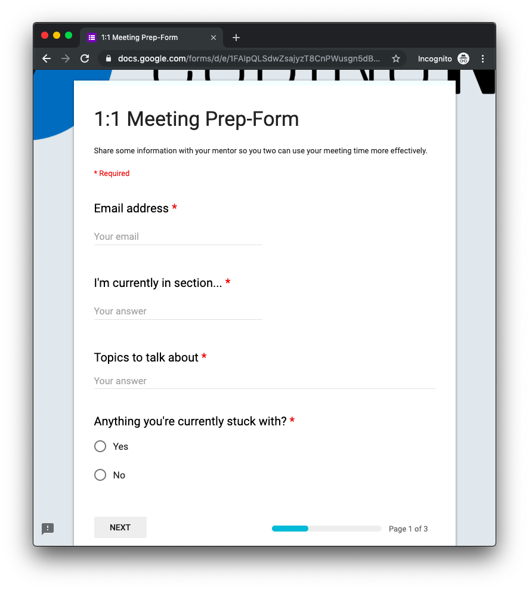
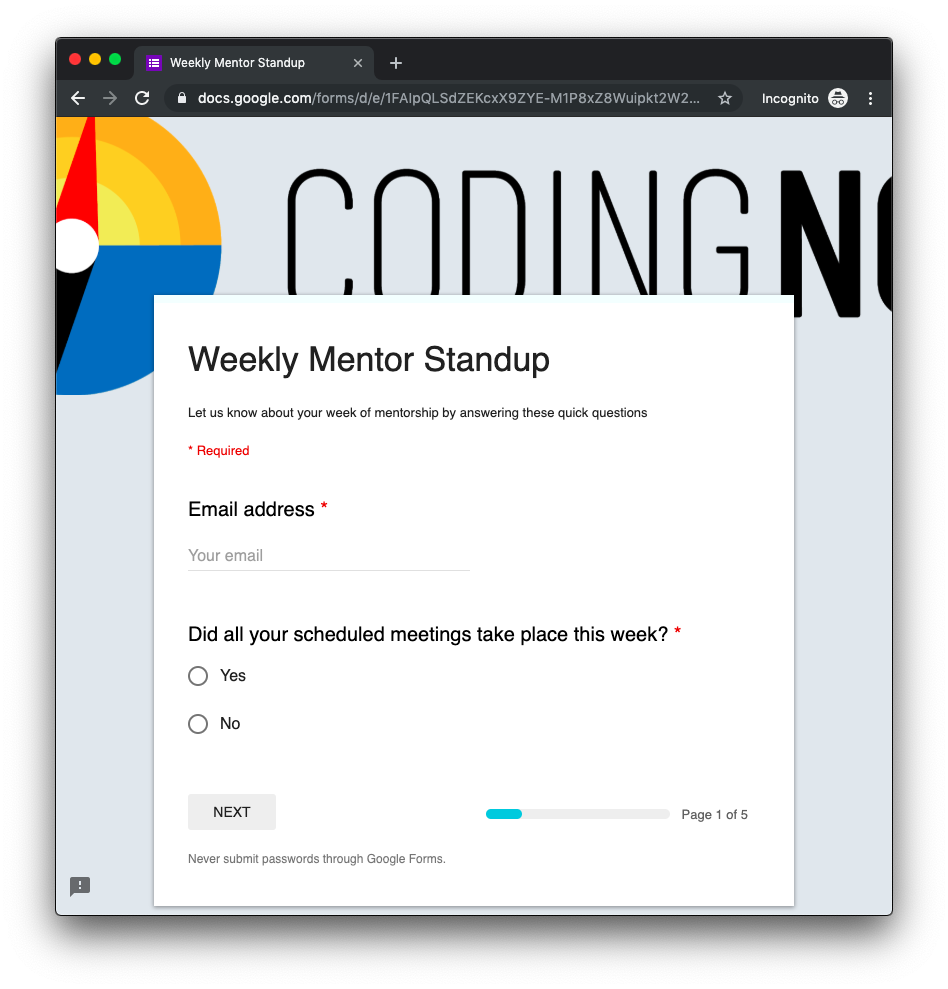

# CodingNomads Mentorship Process

This document contains a breakdown of the logistics surrounding our mentorship process, with links to other documents that have in-depth descriptions.

[TOC]

## Start To Work With A Student

After you've become a part of our Mentor community, we will want to connect you with students. This happens as follows:

1. **Availability**: We reach out to you to see if you're available to take on a new student.
2. **Student Info**: Once you accept, we'll send you the student's background info.
3. **First Contact**: We send a shared email to both you and your student, to introduce you and establish the initial contact.
4. **First Call**: You reach out to your new mentee to schedule your first call, which is a full-time mentor call. Please send a calendar invite to the student and calendar@codingnomads.co, and the contact method you'll use to get in touch. [Calendly](https://calendly.com/) is a useful tool to help you find a common time slot.
5. **Recurring Weekly Call**: During your first call, you will schedule your [standing weekly 1-on-1 call](03_mentorship_process.md#core-duty-2-weekly-1-on-1-calls) with your student.

**Note:** We use Zoom to record all meetings for the student and our records. Here's info on [Using Zoom for scheduling, video sessions, and recordings](05_tools.md#video-sessions-and-recordings-with-zoom).

### First Call

**Preparation**: Before your first call, ask the students per email to make as much progress on the beginning sections of the course (machine setup etc.) as possible. This will make your first meeting more productive - a great way for the student to kick off!

**Introduction**: Since this will be the first time that you and your mentee meet face-to-face, take 10-15 minutes  to get to know them and discuss their goals and expectations for the course. Setting clear expectations as well as clearly knowing _why_ the student is taking the course is helpful for themselves, as well as for you, in order to better keep them accountable.

**Screen-Sharing**: Next dive right into letting them share their screen. Make sure they’ve got everything installed correctly, IDE downloaded, labs open in the IDE and able to run applications and push their work to GitHub. Help them fix what might still be missing. If there is extra time, go further into using Git or getting cozy working with their IDE.

- [Student Support Checklist](08_checklist.md)

## CORE DUTY #1: Make Your Support Felt

Our students need to know that **you are with them and care for their progress**:

- **Reach out to them regularly** to ask how things are going
- Stay up-to-date with their **progress** using their [Outline Report](05_tools.md#progress-check-ins-with-the-learning-platform)
- **Share** an interesting link with them

We want each of our mentors to **make every student feel truly supported**. If possible, think of your students more as friends rather than sticking to a stiff and formal student-teacher relationship.

Like good friends, we want students to feel that we are here for them when they need us. Laughter and friendship go a long way in making sure the learning process is fun, and therefore also productive.

### Get To Know Your Student

When you are assigned to a student, we will send you their background info.

Use your first call to ask them about themselves. Tell them a little bit about yourself as well. Getting to know each other and exchanging personal thoughts is often nicer on a video call than in writing.

We also recommend **keeping a document** with info and notes about your students. It helps to keep track of their individual wishes, motivations, and concerns. These notes are for yourself, but ultimately to improve the individual experience for each of your students. If you want you can copy and use our example draft:

- [Student Notes](13_student_notes.md)

### Answer Forum Questions

Prompt your students to post to, answer, and discuss on the [CodingNomads Forum](http://forum.codingnomads.co). We want to promote the forum as a helpful and welcoming place where students and mentors interact and share knowledge.

Therefore we welcome if you:

- Monitor the Forum regularly
- Prompt your students to discuss questions on the forum
- Answer your students' questions
- Answer other students' questions
- Contribute interesting posts

The more information you and your students share in the public forum, the more benefit will come to the rest of our community.

### Stay Up-To-Date With Your Students' Progress

Knowing where your students are currently at, what they have succeeded to do and what they might be struggling with, is an important piece in making them understand that we care for their learning process and progress.

Our platform offers ways to stay up-to-date with your students' progress. Here are instructions on how to find your students' progress logs. Please **bookmark** these pages for quick access:

- [How to find your student's progress log](05_tools.md#progress-check-ins-with-the-learning-platform)

Before your call, make sure to check where your student is at. This will also help you find topics to discuss if your student doesn't have any specific questions.

### Code Review The Capstone Project

Most mentored courses include at least one larger project, called the **capstone** project. This project makes your students put the content they are learning into practice. Your responsibility as their mentor is to support them through their work on the capstone project:

- **Push** them to keep working on it and get it done.
- **Answer** question they have, and help them with finding solutions.
- Code **review** their project code thoroughly.

We suggest you to [do your code reviews on GitHub](14_tips.md#do-code-reviews-on-github), as this will additionally prepare your students for the real-world experience of receiving code reviews directly in their code on GitHub, as well as to help them practice the process associated with that.

This will be the largest project your students have worked on so far, so be patient and supportive and help them to get it done. There's nothing quite as useful and motivating as having a completed project that you built by yourself :)

### Grade Platform Submissions

Our platform includes some auto-graded submissions (quizzes) and other types of submissions that are meant to be manually graded (assignments).

We are planning to include some form of grading into the mentor's responsibilities since it's motivating for students to see written feedback and encouragement regarding their submissions when done by a thoughtful and supportive mentor.

However, the way these manual submissions are currently set up is only as **check-in points** for students. Therefore, you do not currently need to grade student submissions.

Please make sure to give your students feedback if they ask about any of their submissions, and pro-actively check in with them on whether they want to discuss any of the code they submitted.

## CORE DUTY #2: Weekly 1-On-1 Calls

Alongside with making sure your students feel supported and taken care of during their learning process, the weekly 45-minute 1-on-1 calls are what constitute your core mentorship offering.

- [Using Zoom for scheduling, video sessions, and recordings](05_tools.md#video-sessions-and-recordings-with-zoom)

### Set A Fixed Meeting Time

Schedule the 1-on-1 with your student at a **fixed recurring time every week**. Send a recurring calendar invite for your weekly meetings so it's on both your calendars.

Use your first call to lock in a time slot, then stick to it. No one enjoys the back-and-forth of trying to figure out a time, and we're aware that you have more important (and more fun) things to do with your time.

### Help Your Students Come Prepared

Calls will be more productive if both you and your student come prepared.

To make that more likely, you can:

- send an email or chat message to your student one day before your call
- or copy this [1:1 prep form template](https://docs.google.com/forms/d/e/1FAIpQLSdwZsajyzT8CnPWusgn5dB-9AwI2sZNxJR8PAl5MZZ_bvyldw/viewform) and send it to your student

**NOTE:** In order to receive your students' answers when using the 1:1 prep form, you will need to _"Make a copy"_ and host it on your own Google Drive. The answers are sent to the account that hosts the form.

### Know What To Talk About

During your 1-on-1 call, you **review their labs together and discuss their code**. These labs are the content of their aforementioned submissions. “Grading” these submissions, therefore, happens in a live discussion with the student, rather than separate from the call. This allows students to ask specific questions and brings about a more organic discussion regarding their code.

- See more in [Labs & Projects](04_code_labs.md)

You will **discuss challenging concepts** from the course materials if the student has not quite gotten a grip on them yet. Interested students have interesting questions! Help them find the answers. You are there to help them get unstuck, and help them learn _how_ to get unstuck by themselves.

Finally, you will help them create **study schedules**, set realistic **expectations**, and check in with them on their progress. You are there to **hold them accountable** for their plans. Help them set generous plans for themselves so that they will be able to stick to their plans.

<ins>In short, during your 1-on-1 session you should</ins>:

- **Review** labs and project code together
- **Discuss** course-related concepts
- **Answer** student questions
- **Help** them schedule and stick to their plans

### Record Your Video Calls

Please, **screen-record every student 1-on-1 call**. Having their mentor session recorded is useful for the students because then they can refer back to the video file after their call.

Students can thereby re-watch helpful parts of a meeting. Some students will be more relaxed during the call since they know they can always come back and check if they think they missed something. It also helps us to refer to a shared resource, if any problems should arise.

Recorded sessions also give us the possibility to provide feedback and suggestions to you regarding mentorship. We won't peek into your sessions unless you ask for feedback, or in case there seems to be any trouble. We will always communicate this to you beforehand, and accessing your video recordings will always happen while in communication with you.

### Submit Session Reports (currently optional)

At the end of each session, we ask you to give a short report on how it went that day.

Linked below you will find a Google Form with a few questions.

Please bookmark this form, and **submit a filled-out copy after every call**. This recap **will _not_ be visible to your student** nor to other mentors, but only to you and the CodingNomads team.

We want to keep it short so it doesn't take much of your time. However, consistently keeping short recaps is helpful to monitor student progress and anticipate challenges.

- [Session Report Form](https://docs.google.com/forms/d/e/1FAIpQLSfcYcVSnGAIhEB4wNr4tURIqQ_6lRa0xo7ARpWeDuhFq9a7bA/viewform)

## Weekly Mentor Standup

Every Friday, we ask our **active mentors** to complete a quick form. In this form you'll check in about this week's mentorship. You can raise concerns regarding a student's progress, so we can help and intervene quickly, if necessary.

<ins>Please make sure to submit this form every week</ins>:

- [Weekly Mentor Standup](https://docs.google.com/forms/d/e/1FAIpQLSdZEKcxX9ZYE-M1P8xZ8Wuipkt2W2lE1ArtZCUUO6z1pOtuRA/viewform)

## Time Tracking With TopTracker

To keep track of the time you spend on mentoring your students, please use the TopTracker time tracker. TopTracker is easy to use and makes time tracking (nearly) effortless. We will use your TopTracker-recorded time to calculate your payment each month.

- [How to use TopTracker for CodingNomads time tracking](05_tools.md)

## Wrap Up Working With A Student

When you student progresses well through the course, they will eventually reach the end and graduate.

### Progress Notifications

To stay up-to-date with our students' progress on the organization team, we ask you to send us a couple of progress updates throughout each student's course journey:

- **50% Complete**: Send a chat message or email to Martin when your students is about halfway through the course. This is not an exact marker point, but an approximation.
- **Capstone Started**: Inform us when your student has started working on their capstone project (chat message or email)
- **Capstone Reviewed**: Once your student has finished their capstone project and you have reviewed and approved their code on GitHub, send us the final progress notification per chat message or email. This message should reach us before your final call with the student. Receiving this information from you is extremely important, so that we can commence the close-out process for that student.

### The Final Call

After [reviewing your student's capstone project code](#code-review-the-capstone-project) and **letting us know** that they have completed the course, you'll go on a final close-out call with your student. Similar to your intro call, this call will be a little different than your other 1:1s. Here are some helpful tips to keep in mind:

- **It's The End**: Clearly state to your student that the upcoming call will be your final call. This gives them a chance to revisit topics and assemble some questions that might still linger on their minds.
- **Request Certificate**: Each course includes a Google form at the end that students can submit to request their completion certificate. Encourage them to fill this form if you assess that they have put in the work and completed the course.
- **Give Pointers**: By the time your final call comes around, you will know your student's interests well, so you're encouraged to provide them with tips and suggestions on how to continue their learning journey following their interests.
- **Ask For Satisfaction**: Ask your student if there is anything we can do to make them completely satisfied with our service. We want to provide great mentorship and we want our students to be happy and satisfied. If they have feedback and wishes, let them know we'll do our best and pass on their suggestions to us.
- **Ask For Reviews**: Reviews are important to help others discover and trust our mentoring services. Ask your student to leave us a review on [SwitchUp](https://www.switchup.org/bootcamps/codingnomads) and [CourseReport](https://www.coursereport.com/schools/codingnomads). They can write one and copy-paste to the other service. This is extremely helpful for getting the word out and building trust for our future students.
- **Point To Our Community**: Re-iterate that alumni of our courses are very welcome to keep asking and answering questions on our [Forum](http://forum.codingnomads.co/) and our chat community. They can keep reaching out to us and other students. We would love for them to be an active part of the CodingNomads community.

Please make sure to encourage your student to submit the Google form to request a certificate of completion, if you assess that they have put in the work and completed the course. **Let us know** over chat or email that your student is ready to graduate! 🎉

## Troubleshooting

Check out our [FAQ page](09_faq.md).

## Mentor Support And Questions

If anything regarding the mentorship process is unclear and isn't covered by this document, or if something else went wrong that you need to talk to someone about directly, please feel free to reach out on Slack to me (@Martin Breuss) or Ryan (@Ryan Desmond) or per email: .

If you have questions in regards to your payment, or the payment process in general, please reach out to .

- **Mentorship Contact**: 
- **Payment Contact**: 
