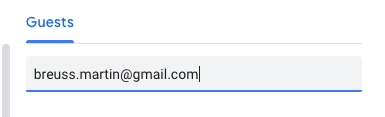
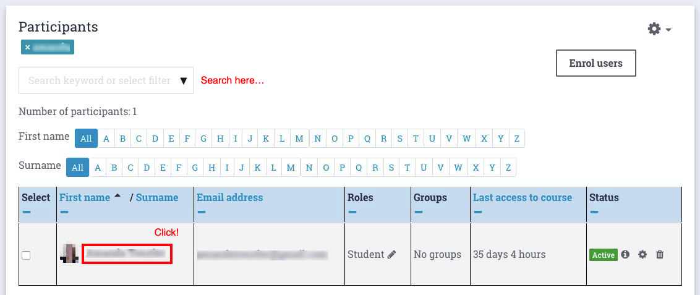

# Tools for CodingNomads Mentors

This page contains a collection of quick how-to guides for using the necessary tools to be an effective CodingNomads Mentor. It starts of with a list of the absolutely essential tools, then describes different tools and how to use them in more detail.

[TOC]

## Essential Software

You'll need these tools in order to be able to mentor a CodingNomads student:

- [TopTracker](05_tools.md#time-tracking-with-toptracker)
- [Google Calendar](05_tools.md#recording-meetings-on-google-calendar)
- [Zoom](05_tools.md#video-sessions-and-recordings-with-zoom)
- [Google Photos](05_tools.md#storage-with-google-photos)
- [Learning Platform](05_tools.mdprogress-check-ins-with-the-learning-platform)
- [GitHub](05_tools.md#code-reviews-with-github)

Please make sure to install these programs and request access, where necessary. You'll find more detailed description in the dedicated sections.

## Time Tracking With TopTracker

Please use **TopTracker** to record your time spent mentoring.

### Set Up TopTracker

To get started, please follow these steps:

- **Download** [TopTracker for Desktop](https://www.toptal.com/tracker)
- **Sign up** for a free account by clicking _Get Started as a Freelancer_
- **Create** a new Project called _Onboarding_

- **Invite** Ryan or Martin to the project as a _Supervisor_

- **Track** time you spent on onboarding under that project

**Skip Payoneer Setup:** We _don't_ use Payoneer for payment. You can skip that section while setting up your TopTracker account.

Tracking your mentorship time will work similarly. In the next section, you'll see how you'll track your mentorship time once you've started working with a student.

### Track Mentorship Time

Once you've started working with a student, we will set up a **Project** with your **student's name** and invite you as a freelancer. From then on, you'll track the time you spend mentoring this student in this dedicated project. If you are working with multiple students, make sure to record your time for each student in the right project.

To minimize your effort, you can limit your tracking entries to the following keywords:

1. call
2. forum
3. slack
4. code review
5. organization
6. team meetings

Watch the screencast below, which shows you how mentorship time tracking with TopTracker works in practice:

<iframe width="560" height="315" src="https://www.youtube.com/embed/Kho8-5TcapE" frameborder="0" allow="accelerometer; autoplay; encrypted-media; gyroscope; picture-in-picture" allowfullscreen></iframe>

Please follow this workflow to keep track of the time you spend working with your student. **Your compensation is based on the recorded time.**

## Scheduling With Google Calendar

You'll use **Google Calendar** for scheduling your student calls. If you don't have a Google account, please [sign up for one](https://accounts.google.com/signup/v2/webcreateaccount?service=cl&continue=https%3A%2F%2Fcalendar.google.com%2Fcalendar%2Frender&gmb=exp&biz=false&flowName=GlifWebSignIn&flowEntry=SignUp).

### Booking Meetings With Calendly

To make life easier for you, you can use [Calendly](https://calendly.com/). It's a handy tool that allows you to block out your availability and let students book meeting times with you through a shareable link.

Using their free tier you can specify the times you are available for meetings, then send your student a link where they can choose a time that fits well for them. They can then book a meeting with you at that time that works for you both.

Calendly can significantly reduce the effort needed to find a time that works for both you and your students. It also integrates with Google Calendar.

### Recording Meetings On Google Calendar

Every student meeting you have needs to be recorded on our **CN Scheduling Calendar** at `calendar@codingnomads.co`. We use this information to keep track of how far along students are in their subscription.

This means you need to:

- **invite** `calendar@codingnomads.co` as a _Guest_ to every recurring student meeting
- **update** any changes to your student meetings on these shared calendar events

Sometimes, students will need to cancel or move a meeting. Make sure that this is reflected on the calendar event that `calendar@codingnomads.co` is added to as a _Guest_. **We can only guarantee payment for meetings that show up on this calendar.**

## Video Sessions and Recordings With Zoom

We use **Zoom** for 1-on-1 calls, because it allows screen sharing and screen recording. Watch the [official video walkthrough](https://www.youtube.com/watch?v=E0XmIIXcrEY) for installing the client and scheduling a meeting.

### Set Up Zoom

Follow the official steps to get started with Zoom:

1. [Download Zoom client](https://zoom.us/download)
2. [Install the browser extension](https://zoom.us/download) (same page, further down)
3. Connect your Google account

Installing the browser extension is optional, and you can schedule all your meetings directly from the Zoom client, if you prefer.

### Schedule A Student Meeting

This screencast and the text below it walk you through how to schedule a meeting using Zoom, and how to make sure it's recorded on the shared _CN Mentorship Calendar_.

<iframe width="560" height="315" src="https://www.youtube.com/embed/lHRX9b_NmEA" frameborder="0" allow="accelerometer; autoplay; encrypted-media; gyroscope; picture-in-picture" allowfullscreen></iframe>

The text below sums up the content of the video in writing, and shows how to schedule the meeting using Zoom's browser extension:

Click _Schedule a Meeting_ in the browser extension:

You'll see the Zoom settings dialog pop up:

You can select _Record the meeting automatically on the local computer_ so you won't have to remember to hit the _Record_ button when you start a student meeting.

Click _Continue_. Zoom will take you to a Google Calendar event creation dialogue that has the Zoom-related information already filled in.

Set the meeting time and use the scheduling options to make it a recurring meeting:

Use the calendar dropdown to change the calendar from your default personal calendar to our shared _CN Mentorship Calendar_:

Finally, invite your student by adding their email address and send the message:

Your Zoom link will be included in the calendar invite the student receives. Double-check that the meeting you set up is a recurring event, and that it's recorded in the _CN Mentorship Calendar_. It should appear in that calendar also for the coming week.

### Record A 1-On-1 Session

If you set the meeting to record automatically, as suggested above, you can skip the first steps. When your meeting begins, make sure that the recording is running.

If you did _not_ set up the automatic recording, click _Record_ -> _Record on this computer_ or click the _Record_ button in the options bar at the bottom once your student meeting has started:

Once your call is finished, click _End Meeting_ and then _End Meeting for all_:

You'll then get a pop-up telling you that the video is being processed:

When the processing is done, the recording will be in your `~/Documents/Zoom/` folder, titled with the date of your session. Each session will have its own folder with a few files in it:

The only file you need is the `.mp4` file, that you'll upload to the shared folder.

### Upload The Recorded Session

Please rename the `zoom_0.mp4` file with a self-explanatory title, e.g.: `date_studentname_topic.mp4`:

Then upload the recording to your shared Google Photos album (see below) by simply dragging it there.

After the video has finished uploading, you can delete it from your local machine.

## Storage With Google Photos

Google Photos allows free video uploads and storage for the video resolution that we are working with. That means the screen recordings won't count against your Google storage space quota.

The screencast below walks you through:

- how to **set up** a new Google Photos **album**
- how to **share it** with us and your student
- how to **upload** a recorded session

<iframe width="560" height="315" src="https://www.youtube.com/embed/auJFJgR_sa4" frameborder="0" allow="accelerometer; autoplay; encrypted-media; gyroscope; picture-in-picture" allowfullscreen></iframe>

The text below walks you through the same topics of the screencast in written form.

Navigate to [Google Photos](https://photos.google.com/) (and sign in to your account if necessary).

Create a new **Shared Album** in your Google Photos account **for each student**:

Name the album with your name and your student's name:

Share the album with that student as well as with :

When sharing the folder, you can add the following message to the invite:

> _Hi! This is our shared album where you'll be able to access the screen recordings of our 1-on-1 sessions._

**Upload the Zoom recordings** of meetings with that student to the student-specific albums by dragging the file onto the open album window:

Uploading the screen recordings of your 1:1 sessions allows your students to check back on topics that you discussed and helps them in their learning process.

## Progress Check-Ins With The Learning Platform

You'll need to keep track of how your student is progressing through the course materials in order to give them actionable feedback and help them keep moving.

Make sure that you have an active account on the [CodingNomads learning platform](https://platform.codingnomads.co/learn/). After you've completed onboarding, you'll get upgraded to the role of _Non-editing Teacher_ to be able to access everything. If you need that access and don't have it yet, please contact .

To find your students' **progress logs**, go to the main course page of your course. You'll see a button in the top left called _Participants_. Click it:

This brings you to a page with a list of all course participants. Use the search field to find your student:

Then click on the student's name to access their profile page.

**Tip: Bookmark this page for each of your students, so you'll be able to access it quickly. Checking up on your students' progress shoud be a simple routine task that doesn't take much of your time.**

On the right of that page, you can see a _Reports_ section. Feel free to explore the different types of reports:

The **_Outline Report_** gives you a quick overview of which resources your student accessed, how often, and when. When a student has accessed a page, it'll show a view count and a date next to the resource name:

If they haven't accessed the resource yet, these two columns will be missing:

The **_Outline Report_** allows you to quickly understand where your student is currently at, whether they are making progress, and it can help you understand what they might be struggling with.

## Code Reviews With GitHub

We use GitHub inline comments for code reviews. Check out the forum post [Giving and getting code reviews](http://forum.codingnomads.co/t/about-the-code-reviews-category/38) for suggestions on how to give helpful and effective code reviews.

If you are not familiar with giving code reviews in GitHub, check out our [Guide on giving GitHub Reviews](14_tips.md#do-code-reviews-on-github).

## Feedback With Trello

We welcome your feedback and suggestions! To keep them organized, please add them to the relevant [Feedback Trello Boards](https://trello.com/cnsuggestions1/home).

Once you complete onboarding, we will add you to the CN Feedback team so you can access the board home page.

Each board has the same structure with the following columns:

- Backlog
- Doing
- Done
- Wishlist

Please add your bug reports to _Backlog_ and your improvement suggestions to _Wishlist_.

Include every useful piece of information that you can provide, to make it easier for us to tackle the challenge.

A Trello card can include:

- Comments
- Screenshots
- Links to course sections
- Links with more info, code repos, etc.
- Labels
- Members

Please **add yourself as a Member to the card** so that it will be easier for us to get in contact if we need more information.

## Student Communication Templates

You can set communication snippets up as [Gmail templates](https://www.lifewire.com/how-to-set-up-and-use-email-templates-in-gmail-1172103) or copy-paste the content from the resource linked below. Please replace the fields marked with `{ALL_CAPS}`.

Feel free to personalize as much as you want to. These templates are meant to make it quicker for you to get started communicating with your students, but _personal_ communication is priceless for good mentorship results.

- [Student Communication Templates](12_templates.md)

Please add any relevant repeating communications that you create so that other mentors can benefit from it, or let us know when you think that something is missing.

## Other Useful Tools

The following tools have been useful for some mentors. You can include them in your workflow if they seem helpful for you.

### Worldtimebuddy

A great tool for scheduling across multiple time zones. I use this all the time.

- [https://www.worldtimebuddy.com/](https://www.worldtimebuddy.com/)

### Doodle

Helpful for remotely deciding for a call time, especially when there are many people involved. Can also be helpful for scheduling your first orientation call with your student.

- [https://doodle.com/create](https://doodle.com/create)

However, setting up your [Calendly](https://calendly.com/) account is probably more convenient and easier to handle.

### There

A MacOS app that helps keeping track of all your students' current times across multiple time zones. Nicely integrated in OS X and helps to quickly check up on whether someone's up or sleeping.

- [https://there.pm/](https://there.pm/)
