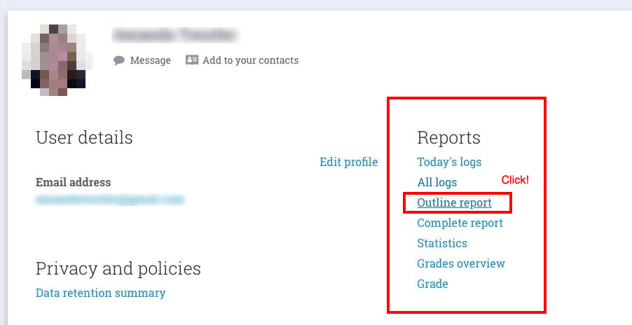

# Tools for CodingNomads Mentors

This page contains a collection of quick how-to guides for using the necessary tools to be an effective CodingNomads Mentor. It starts with a list of the absolutely essential tools, then describes how to use them in more detail.

[TOC]

## Essential Software

You'll need these tools in order to be able to mentor a CodingNomads student:

- [TopTracker](05_tools.md#time-tracking-with-toptracker)
- [Google Calendar](05_tools.md#recording-meetings-on-google-calendar)
- [Zoom](05_tools.md#video-sessions-and-recordings-with-zoom)
- [Learning Platform](05_tools.md#progress-check-ins-with-the-learning-platform)
- [GitHub](05_tools.md#code-reviews-with-github)

Please make sure to install these programs and request access where necessary. You'll find more detailed descriptions in the dedicated sections.

## Time Tracking With TopTracker

Please use **TopTracker** to record your time spent mentoring.

### Set Up TopTracker

To get started, please follow these steps:

- **Sign up** for a free account by clicking _Get Started as a Freelancer_.
- **Notify** Jared (or Ryan) to add you to the _Onboarding_ project. You'll receive an invitation from `admin@codingnomads.co` to join the project called _Onboarding_ as a _Freelancer_.
- **Track** the time you spend on onboarding under that project. You can also add manual time entries, for the time you tracked before we managed to invite you to the project.
- **Download** [TopTracker for Desktop](https://www.toptal.com/tracker), if you prefer to track your time in a dedicated app.

**Skip Payoneer Setup:** We _don't_ use Payoneer for payment. You can skip that section while setting up your TopTracker account.

### Track Mentorship Time

Once you've started working with a student, we will set up a **Project** with your **student's name** and invite you as a _Freelancer_. From then on, you'll track the time you spend mentoring this student in their dedicated project. If you are working with multiple students, make sure to record your time for each student in the correct project. 

To minimize your effort, you can limit your tracking entries to the following keywords:

1. call
2. forum
3. slack
4. code review
5. organization

We will also invite you to two projects called "mentor_admin" and "Community Support". Mentor_admin can be used for miscellaneous administrative activities such as internal meetings (e.g., meeting with Ryan). “Community Support” can be used to answer questions on the forum or the general slack channels (i.e., helping students for which you don’t have a specific project). When charging to these two projects, please be as specific as possible in the TopTracker activity description. For example: “supporting Tiffany on Slack, connecting to databases, general JDBC” or “responded to this question: https://forum.codingnomads.co/t/lab-9-data-wrangle-a-dataset/1244”

Watch the screencast below, which shows you how mentorship time tracking with TopTracker works in practice:

<iframe width="560" height="315" src="https://www.youtube.com/embed/Kho8-5TcapE" frameborder="0" allow="accelerometer; autoplay; encrypted-media; gyroscope; picture-in-picture" allowfullscreen></iframe>

Please follow this workflow to keep track of the time you spend working with your student. **Your compensation is based on the recorded time, and the invoices you generate (see next step).**

### Wait, but what if I forget turn on my tracker?  Or, even worse, forget to turn it off?
TopTracker allows you to manually add, edit, or delete time.

### Generate and Submit Your Invoices

On the first day of each month, please submit an invoice for each of your TopTracker projects for the previous month. Please see the screenshot below for this process, and refer to the [Monthly Payment Process](07_payment.md#monthly-payment-process) for more details about invoicing and payments.

1. Click _Invoices_ tab on the left
2. Click the green button called _Create Invoice_ in the top right 
3. Select the project you want to invoice for
4. Adjust dates to the first and last day of the previous month
5. Click _Save Draft_ and _Preview_ in the bottom right
6. Click _Send Invoice_

You need to submit a separate invoice for each of your students. Please submit all invoices each month in order to get paid.

## Scheduling With Google Calendar

You'll use **Google Calendar** for scheduling your student calls. If you don't have a Google account, please [sign up for one](https://accounts.google.com/signup/v2/webcreateaccount?service=cl&continue=https%3A%2F%2Fcalendar.google.com%2Fcalendar%2Frender&gmb=exp&biz=false&flowName=GlifWebSignIn&flowEntry=SignUp).

**Always invite "calendar@codingnomads.co" to all meetings** 

**Also Please include the student's name in the meeting title**.  For example "Ryan and Michael". This helps us to keep track of the student's meetings.   

### Booking Meetings With Calendly

To make life easier for you, you can use [Calendly](https://calendly.com/). It's a handy tool that allows you to block out your availability and let students book meeting times with you through a shareable link.

Using their free tier, you can specify the times you are available for meetings, then send your student a link where they can choose a time that works for them.

Calendly can significantly reduce the effort needed to find a time that works for both you and your students. It also integrates with Google Calendar.

### Recording Meetings On Google Calendar

Every student meeting you have needs to be recorded on our **CN Scheduling Calendar** at `calendar@codingnomads.co`. We use this information to keep track of how far along students are in their subscription.

This means you need to:

- **invite** `calendar@codingnomads.co` to every student meeting
- **update** any changes to your student meetings on these shared calendar events

Sometimes, students will need to cancel or move a meeting. Make sure to update the calendar by moving or deleting the meeting.

**We can only guarantee payment for meetings that show up on this calendar.**

You will also be invited to a calendar invite that represents the student's last week at CodingNomads.  If you and your student decide not to meet one week, please update the calendar to add a week to the student's program.  For example, if your student requests a week off for christmas (encouraged!), and their last date is January 1st, then update the calendar to show that their last date is now January 8th.  If there is any confusion on this topic, please ask Jared or Michael. 

## Video Sessions and Recordings With Zoom

We use **Zoom** for 1-on-1 calls, because it allows screen sharing and screen recording. Watch the [official video walkthrough](https://www.youtube.com/watch?v=E0XmIIXcrEY) for installing the client and scheduling a meeting.

### Set Up Zoom

Follow the official steps to get started with Zoom:

1. [Download Zoom client](https://zoom.us/download)
2. [Install the browser extension](https://zoom.us/download) (same page, further down)
3. Connect your Google account

Installing the browser extension is optional, and you can schedule all your meetings directly from the Zoom client, if you prefer.

### Schedule A Student Meeting

This screencast and the text below it walk you through how to schedule a meeting using Zoom, and how to make sure it's recorded on the shared _CN Mentorship Calendar_.

<iframe width="560" height="315" src="https://www.youtube.com/embed/lHRX9b_NmEA" frameborder="0" allow="accelerometer; autoplay; encrypted-media; gyroscope; picture-in-picture" allowfullscreen></iframe>

The text below sums up the content of the video in writing, and shows how to schedule the meeting using Zoom's browser extension:

Click _Schedule a Meeting_ in the browser extension:

You'll see the Zoom settings dialog pop up:

Click _Continue_. Zoom will take you to a Google Calendar event creation dialogue that has the Zoom-related information already filled in.

Set the meeting time and use the scheduling options to make it a recurring meeting:

Use the calendar dropdown to change the calendar from your default personal calendar to our shared _CN Mentorship Calendar_:

Finally, invite your student by adding their email address and send the message:

Your Zoom link will be included in the calendar invite the student receives. Double-check that the meeting you set up is a recurring event, and that it's recorded in the _CN Mentorship Calendar_. It should appear in that calendar also for the coming week.

### Recording 1-On-1 Sessions

We used to ask mentors to record every meeting: **this is no longer required**  Instead, please encourage your students to record sessions if they'd like to.

## Progress Check-Ins With The Learning Platform

You'll need to keep track of how your student is progressing through the course materials in order to give them actionable feedback and help them keep moving.

Make sure that you have an active account on the [CodingNomads learning platform](https://platform.codingnomads.co/learn/). After you've completed onboarding, you'll get upgraded to the role of _Non-editing Teacher_ to be able to access everything. If you need that access and don't have it yet, please contact .

To find your students' **progress logs**, go to the main course page of your course. You'll see a button in the top left called _Participants_. Click it:

This brings you to a page with a list of all course participants. Use the search field to find your student:

Then click on the student's name to access their profile page.

**Tip: Bookmark this page for each of your students, so you'll be able to access it quickly. Checking up on your students' progress shoud be a simple routine task that doesn't take much of your time.**

On the right of that page, you can see a _Reports_ section. Feel free to explore the different types of reports:

The **_Outline Report_** gives you a quick overview of which resources your student accessed, how often, and when. When a student has accessed a page, it'll show a view count and a date next to the resource name:

If they haven't accessed the resource yet, these two columns will be missing:

The **_Outline Report_** allows you to quickly understand where your student is currently at, whether they are making progress, and it can help you understand what they might be struggling with.

## Code Reviews With GitHub

We use GitHub inline comments for code reviews. Check out the forum post [Giving and getting code reviews](http://forum.codingnomads.co/t/about-the-code-reviews-category/38) for suggestions on how to give helpful and effective code reviews.

If you are not familiar with giving code reviews in GitHub, check out our [Guide on giving GitHub Reviews](14_tips.md#do-code-reviews-on-github).

## Student Communication Templates

You can set communication snippets up as [Gmail templates](https://www.lifewire.com/how-to-set-up-and-use-email-templates-in-gmail-1172103) or copy-paste the content from the resource linked below. Please replace the fields marked with `{ALL_CAPS}`.

Feel free to personalize as much as you want to. These templates are meant to make it quicker for you to get started communicating with your students, but _personal_ communication is priceless for good mentorship results.

- [Student Communication Templates](12_templates.md)

Please add any relevant repeating communications that you create so that other mentors can benefit from it, or let us know when you think that something is missing.

## Other Useful Tools

The following tools have been useful for some mentors. You can include them in your workflow if they seem helpful for you.

### Worldtimebuddy

A great tool for scheduling across multiple time zones. I use this all the time.

- [https://www.worldtimebuddy.com/](https://www.worldtimebuddy.com/)

### Doodle

Helpful for remotely deciding for a call time, especially when there are many people involved. Can also be helpful for scheduling your first orientation call with your student.

- [https://doodle.com/create](https://doodle.com/create)

However, setting up your [Calendly](https://calendly.com/) account is probably more convenient and easier to handle.

### There

A MacOS app that helps keeping track of all your students' current times across multiple time zones. Nicely integrated in OS X and helps to quickly check up on whether someone's up or sleeping.

- [https://there.pm/](https://there.pm/)
