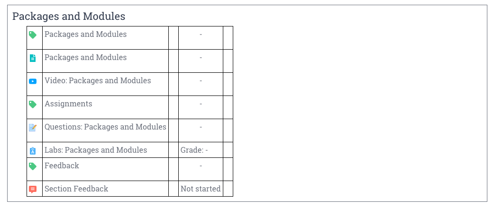

# Tools for CodingNomads Mentors

A collection of quick how-to guides for using the necessary tools to be an effective CN Mentor.

[TOC]

# Student Communication Templates

You can set communication snippets up as [Gmail templates](https://www.lifewire.com/how-to-set-up-and-use-email-templates-in-gmail-1172103) or copy-paste from the resource linked below. Please replace the fields marked with {ALL_CAPS}.

Feel free to personalize as much as you want to. These templates are meant to make it quicker for you to get started communicating, but personal communication is priceless for good mentorship results.

* [Student Communication Templates](12_templates.md)

Please add any relevant repeating communications that you might create yourself, or comment when you think that something is missing.

# Time Tracking with TopTracker

Please use the TopTracker time tracker for keeping track of your mentor work time.

## Get Started With TopTracker

To get started, please follow these steps:

1. **Download** [TopTracker for Desktop](https://www.toptal.com/tracker)
2. **Sign up** for a free account by clicking <kbd>Get Started as a Freelancer</kbd>
3. **Notify** Martin or Ryan once you're set up
4. **Accept** the invite you will receive for a project called _Onboarding_
5. **Track** time you spent on onboarding under that project

The process of accepting an invite to a project, then tracking your time related to this project, is one you will repeat for each student you will work with. Let's look in more detail at how the time tracking will work when you've started working with a student in the next section.

## Track Mentorship Time

Once you started working with a student, we will set up a <kbd>Project</kbd> with your **student's name** and invite you to it as a freelancer. From then on, you will track the mentorship time you spend related to this student in this student project. If you are working with multiple students, make sure to record your time accordingly.

To track the time you work with your student with minimal effort, you can limit your tracking entries to the following:

1. call
2. forum
3. slack
4. code review
5. organization
7. team meetings

Below is a screencast that shows you how time tracking with TopTracker works in practice:

<iframe width="560" height="315" src="https://www.youtube.com/embed/Kho8-5TcapE" frameborder="0" allow="accelerometer; autoplay; encrypted-media; gyroscope; picture-in-picture" allowfullscreen></iframe>

Please follow this workflow to keep track of the time you spend working with your student, as your compensation is based on the recorded time.

# Scheduling: Google Calendar

We use Google Calendar for scheduling. If you don't have a Google account, [please sign up for one](https://accounts.google.com/signup/v2/webcreateaccount?service=cl&continue=https%3A%2F%2Fcalendar.google.com%2Fcalendar%2Frender&gmb=exp&biz=false&flowName=GlifWebSignIn&flowEntry=SignUp) and accept the invite to our shared mentor calendar.

If you haven't received an invitation to the shared mentor calendar, please request an invite by writing to .

## Setting Your Availability

To improve visibility and make it easier to pair students with mentors based on their availability, we ask you to add your general availability to our shared Mentorship Calendar.

<iframe width="560" height="315" src="https://www.youtube.com/embed/A1echzaLETk" frameborder="0" allow="accelerometer; autoplay; encrypted-media; gyroscope; picture-in-picture" allowfullscreen></iframe>

# Video Sessions and Recordings: Zoom

We use **Zoom** for 1-on-1 calls because it allows for simple screen sharing and screen recording.

Watch the [official video walkthrough](https://www.youtube.com/watch?v=E0XmIIXcrEY) for installing the client and scheduling a meeting.

## Get set up with Zoom

1. [Download Zoom client](https://zoom.us/download)
2. [Install the browser extension](https://zoom.us/download) (same page, further down)
3. Connect your Google account

## Schedule a student meeting

<iframe width="560" height="315" src="https://www.youtube.com/embed/lHRX9b_NmEA" frameborder="0" allow="accelerometer; autoplay; encrypted-media; gyroscope; picture-in-picture" allowfullscreen></iframe>

* Click “Schedule a meeting” on the browser extension

* This opens up a Zoom settings dialog

* (Recommended) Select _“Record the meeting automatically on the local computer”_ so you won't have to remember to hit the “Record” button
* After pressing “Continue”, you will then be taken to a familiar Google Calendar event creation dialogue, with the Zoom-related information already filled in
* Set the meeting time, and use the scheduling options to make it recurrent

* Use the dropdown to change the calendar to our shared Google calendar for mentors

* Finally, invite your student by adding their email address and send the message

The relevant Zoom link will be included in the calendar invite. Double-check that the meeting you set up is a recurring event. It should appear in your calendar also for the coming week.

## Record a 1-on-1 session

If you set the meeting to record automatically, as suggested above, you can skip the first steps. When your meeting begins, make sure that the recording is running.

* If you did not set up the automatic recording, click “Record” -> “Record on this computer” or the “Record” button at the bottom options bar once your meeting has started.

* After you end the meeting by clicking “End Meeting” and then “End Meeting for all”, you'll get a popup that says the video is being processed.

When the processing is done, the recording will be in your `~/Documents/Zoom/` folder, titled by the date of the session.

## Upload the recorded session

* Please rename the “zoom_0.mp4” file with a self-explanatory title, e.g.: “date_studentname_topic.mp4”

* Then upload the recording to your shared Google Photos album (see below) by simply dragging it on there.
* After the video has finished uploading, you can delete it from your local machine

# Storage: Google Photos

_Google Photos allows free video uploads and storage for the video resolution that we are working with. That means it **won't count against your Google storage space quota**._

<iframe width="560" height="315" src="https://www.youtube.com/embed/auJFJgR_sa4" frameborder="0" allow="accelerometer; autoplay; encrypted-media; gyroscope; picture-in-picture" allowfullscreen></iframe>

* Navigate to [Google Photos](https://photos.google.com/) (and sign in to your account if necessary)
* **Create a new Shared Album in your Google Photos account for each student**

* Share it with that student as well as with .

* You can add the following message (or something similar) to the invite:

>_Hi! This is our shared album where you will be able to access the screen recordings of our 1-on-1 sessions._

* **Upload the Zoom recordings** of meetings with that student to the student-specific albums by dragging it onto the open album window.

# CodingNomads Learning Platform

## How to find student progress logs

When you're logged in to the learning platform and are on your course page, you will see a button in the top left called “Participants”. Click it.

This brings you to a page with a list of all the course participants. Use the search field to find your student.

Then click on the student's name to access their profile page.

**Tip: Bookmark this page for each of your students, so you will be able to access it quicker and that checking up on their progress becomes a simple routine task that doesn't take much of your time.**

On the right of that page, you can see a “Reports” section. Feel free to explore the different types of reports.

Using the “**Outline Report**” allows a quick overview of which resources your student accessed, how often and when. When a student has accessed a page, it displays like so:

If they haven't accessed the resource yet, the section instead looks like this:

Therefore, the “**Outline Report**” allows you to quickly understand where your student is currently at, what they might be struggling with, etc.

# Code Reviews: GitHub

Currently, we use GitHub inline comments for code reviews. Check out the **Forum Post** for suggestions on how to do those.

*   [Giving and getting code reviews](http://forum.codingnomads.co/t/about-the-code-reviews-category/38)

# Feedback: Trello

We welcome your feedback and suggestions! To keep them organized, please add them to the relevant Trello boards.

Once you complete onboarding, we will add you to the CN Feedback team so you can access the board home page

*   [Feedback Trello Boards](https://trello.com/cnsuggestions1/home)

Each board has the following structure:

Please add your bug reports to “Backlog” and your improvement suggestions to “Wishlist”.

Include every useful piece of information that you can provide, to make it easier for us to tackle the challenge.

A Trello card can include:

*   Comments
*   Screenshots
*   Links to course sections
*   Links with more info, code repos, etc.
*   Labels
*   Members

Please **add yourself as a Member** so that it will be easier for us to get in contact if we need more information.

# Additional useful tools

## Worldtimebuddy

A great tool for scheduling across multiple time zones. I use this all the time.

*   [https://www.worldtimebuddy.com/](https://www.worldtimebuddy.com/)

## Doodle

Helpful for remotely deciding for a call time, especially when there are many people involved. Can also be helpful for scheduling your first orientation call with your student.

*   [https://doodle.com/create](https://doodle.com/create)

## There

A MacOS app that helps keeping track of all your students' current times across multiple time zones. Nicely integrated in OS X and helps to quickly check up on whether someone's up or sleeping.

*   [https://there.pm/](https://there.pm/)
