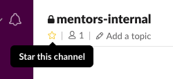

# CodingNomads Mentor Community

We're all better in a bunch, and socially learning from your peers is a great and effective way to improve. At CodingNomads, we want to nurture a motivated community of mentors who care for what they do, for their students, and for each other. And we want to make an effort to help you help each other on the way of getting better at what you're already good at. :)

[TOC]

# Internal Communication

Use our mentor slack channel and our [mentor-related Forum](http://forum.codingnomads.co/c/staff/mentorship) section to interact with your fellow mentors.

## Slack Channel

We have a mentor-only slack channel called **#mentors-internal**. If you haven't been added, please contact .

To make sure you're posting in the right channel, I'd suggest to _star_ the channel so it remains pinned to the top of your channel list:

Please remember that information in our slack channels is _ephemeral_. Anything you write here will eventually be lost on slack's servers. It is still great for chatting and quick information exchange, however, if you and your fellow mentors have some great ideas or suggestions, please add those thoughts for discussion into our persistent and searchable Forum.

## Mentor Forum Section

Our forum has a _Staff_ section that is invisible to students. Use the _Mentorship_ category to post and discuss ideas with your fellow mentors and the rest of our team.

If you don't have access to this section, please contact .

*   [Mentorship category on the Forum](http://forum.codingnomads.co/c/staff/mentorship)

# Mentor team meetings

**Every month we'll have a team call** all together so we stay in sync with each other and exchange mentorship related knowledge and ideas. We can also discuss possible ways to improve our mentor community.

Bring your ideas and suggestions! This call will be compensated per your normal hourly rate. We appreciate your time and your input!

# Peer reviews

Show the other mentors your work. Allow them to learn from you and learn from them and their feedback. Small circles of people that have a strong interest in something and stick together to openly, constructively, criticize each other - that's how specialized groups of people develop.

It would be awesome if we together developed ourselves as an elite group of awesome code mentors that are close to each other, highly skilled, super effective in teaching students to code, and essentially can go out and rule the world! ;)
