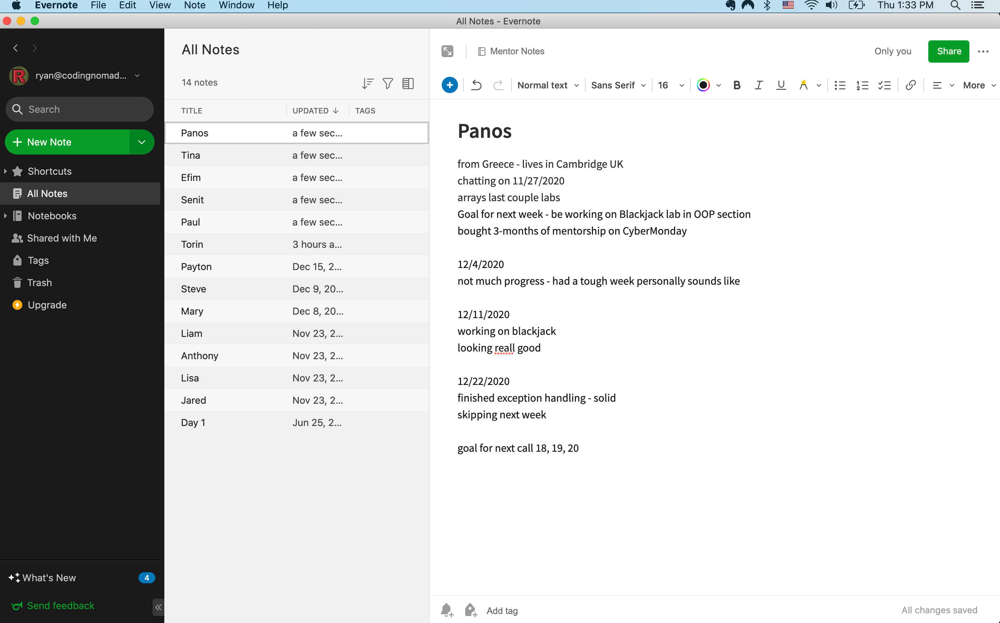

# Student Info And Notes

Keeping track of things discussed with students during individual calls, as well as their background and ambitions, to know how to help them progress the best towards their aims.

Use any note-taking app that you like and that you're familiar with. Some examples of apps that our mentors like are:

- [Obsidian](https://obsidian.md/)
- [Evernote](https://evernote.com/)
- [Google Docs](https://docs.google.com/)
- [Microsoft OneNote](https://www.microsoft.com/de-at/microsoft-365/onenote/digital-note-taking-app)

Here are some examples of what these notes could look like. You don't need to write so much and it's enough to keep track using keywords if that works well for you. Everyone has their own style. Use whatever works best for you to stay on top of your students progress and their aims.

## Example Evernote



## Example Markdown

```md
# Student Name (_fictional example_)

## Quick Info

*   Based in the Netherlands
*   works full-time and spends their evening on the course material

## Interests

*   Programming related networking from a while ago
*   Proficiency in Python to automate tasks in their company
*   Web Development, building out their own ideas with code

## Calls

### 2019-05-02

Still setting up with the student. They are using Linux, so they've stumbled into a couple of issues. We installed Discord together, as well as git, and cloned the repo so they can begin to work on the labs.

They haven't had much time because of a big project at work but said it's done now and as of tomorrow will have more time to focus fully on the course.

They are self-taught with SQL and worked as a data analyst before. It's clear that they know how to google and are motivated to work through stuff. They were a bit worried there'd be too much reading for their taste, but I explained about the labs and projects and that I'm happy to provide more project ideas and links to make it even more practical. That seemed to resound well with them.

### 2019-05-09

They skimmed over the exercises and completed some that they didn't know so well yet (File I/O etc.). I introduced code reviews, both that I can do them if they submit links, as well as that I'll want students to do it for each other on the Forum, if possible.

They are originally from Veenendaal, which is fun for me because I spent two weeks there working with a friend on a startup idea.

They've been working on a Django project before (a course platform, essentially) and they'll keep doing that while brushing up on the topics covered in our course. I introduced that it's very useful that they know something already, and that they'll be able to learn a lot through teaching others on the Forum. They're looking forward to the interactions and discussions. I think it will be helpful to direct them to use the Forums as often as possible since they could provide good contributions AND seem to learn very well through discussing and explaining topics.
```

## Template

You can use this template, if you're keeping your notes in Markdown.

```md
## Student Name

### Quick Info

-

### Interests

-

### Calls
```
