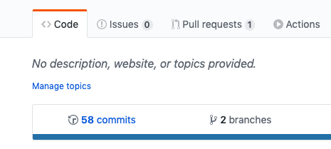
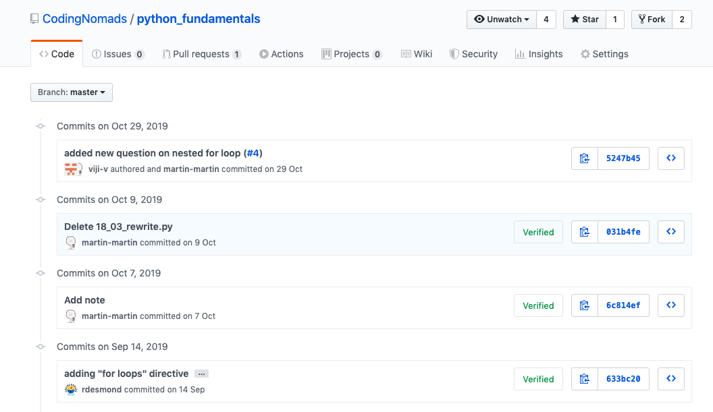
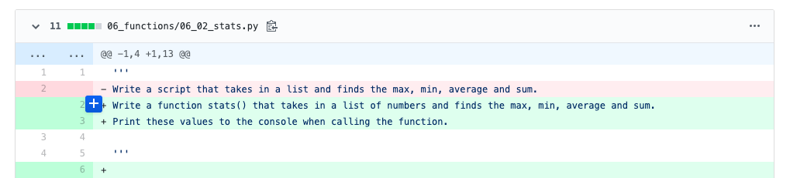
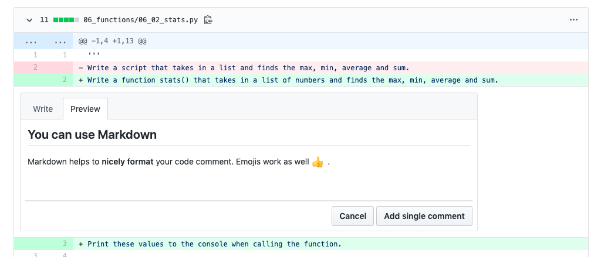

# Mentorship Tips

A collection of practical tips collected by mentors throughout the mentorship process. Feel free to add your own.

## Structure Your 1-On-1 Sessions

Here are some suggestions that can make it easier to set yourself and your student up for a productive 1:1 call.

- Send them [a reminder and some prep questions](12_templates.md#preparation-for-the-weekly-call) 1 day before your scheduled call
- Say hi on chat frequently, and be friendly and motivating
- Ask whether they have any specific struggles or questions
- Ask them to walk you through everything they did since your last call

For more tips, you can read the section on how to [Know What To Talk About](03_mentorship_process.md#know-what-to-talk-about).

## Push For Regular Meetings

It is important to meet with your student, even if nothing went forward on their end. It’s first and foremost the human contact that creates and upkeeps motivation. Encourage your students to meet regularly! You can use a template to [prompt to stick with weekly meetings](12_templates.md#prompt-to-stick-with-weekly-meetings). Find a time that works for them, and stick to it.

> Social accountability is motivating for humans!

## Teach And Learn Through Code Reviews

GitHub allows you to create in-line code comments in commits. Giving and getting code reviews is a great way to improve your coding skills. It trains you to:

- **read and understand** other people's code
- learn about **different solutions** to a task
- **formulate** your thoughts in relation to code
- give constructive **feedback**, and learn from receiving it

Below, you'll find more information about how we suggest to do code reviews on GitHub, and what to focus on.

### Code Review Guidelines

- **Be Nice**: When you give a code review to a student, be nice! No one benefits from a nasty review.
- **Give Directions**: As with mentorship in general, avoid giving solutions directly. Find the solution yourself, then give the other person hints so they can figure it out on their own. We learn the most by figuring something out ourselves.
- **Use Markdown**: Readability helps. Use Markdown to make your comment nicely formatted. And you can use emojis, too.

### Types Of Code Review Comments

1. **Suggestions**: Suggest improvements if you find something that's incorrect or could be improved.
2. **Congratulations**: Give positive feedback if there's something you liked or found interesting.
3. **Challenges**: Introduce challenges if you see that someone is onto something and might benefit from a nudge into a specific direction.

### Examples [TODO]

Here are some examples of code reviews from the on-site course part. Read over them to get an idea of how to give code reviews.

## Do Code Reviews On GitHub

Every time your student commits code and pushes it to GitHub, it will be available for other people to comment on. Use the great in-line code comment functionality on GitHub commits to facilitate learning and get your students used to the idea of code reviews.

> Go over how to create and interact with GitHub code comments together with your student on a call.

### Add Code Comments On GitHub

Here's a step-by-step walk-through for adding a comment to a GitHub commit:

Go to your student's GitHub account, choose the right repository and navigate to their commits:

You will see a page similar to the following screenshot. Once there, click on a single commit (you can do this for every commit!). This steps you into the code that was added/changed/deleted during that specific commit:

Inside of a commit's page, you'll see code lines, some of them green and red. The view is split up on a per file basis and you can easily comment directly in a specific line by clicking on the blue plus that appears when hovering over a line:

Clicking it opens up a comment box, like so:

Type your code comment into this box. Remember [our code review tips](14_tips.md#teach-and-learn-through-code-reviews), e.g. that Markdown is supported. You can check up on your result by clicking the _Preview_ tab:

Finally, click _Add single comment_ and your feedback is live!

You can also reply to a comment on GitHub.
