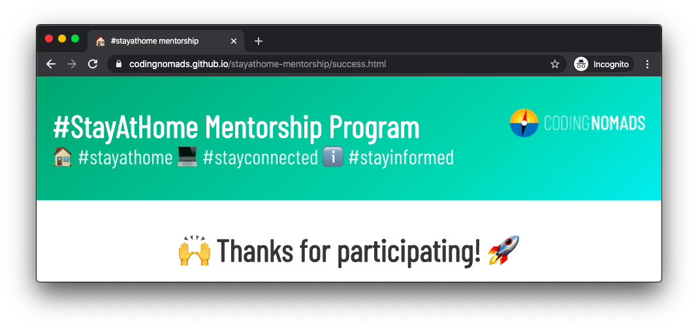

# #StayAtHome COVID-19 Mentorship Program

If you are a volunteer mentor with the [#StayAtHome program](https://github.com/CodingNomads/stayathome-mentorship/blob/master/README.md), several sections in these docs will not apply to you. Please feel free to use them as a reference and guide for conducting quality and effective mentorship.

- **Here's the tl;dr page: [Mentorship Practical Tips](14_tips.md)**
- **Here's a quick FAQ for #StayAtHome Mentors: [StayAtHome Mentorship FAQ](15_home_faq.md)**

And some more links to relevant sections:

- **[What Mentorship Means To Us](01_requirements.md#what-does-mentorship-mean-to-us)**: Thoughts on why good mentorship can make a huge difference
- **[How To Be A Great Mentor](04_how_to_mentor.md)**: Thoughts on ways to approach mentorship (more theoretical)
- **[Mentorship Process Blueprint](03_mentorship_process.md)**: Suggestions and step-by-step tips on how to conduct an effective mentorship session (no need to read further than "Record your video sessions") (more practical)
- **[Tools For Mentors](05_tools.md)**: Processes, programs and tools that can be helpful to support you when conducting mentorship
- **[Student Support Checklist](08_checklist.md)**: Quick checklist to keep most important points in mind

[TOC]

## Mentorship Tips

[Read our quick mentorship tips here](14_tips.md).

## Having Trouble With A Student/Mentee?

Please inform Ryan () and Martin () as quickly as possible and we'll help get everything sorted.

## Establishing Contact With Students

Reach out to your mentee over email, introduce yourself, and start scheduling your first 1-on-1 call.

**Use Zoom**: If possible, please use Zoom for these calls. That way, you and/or your student can record the call. Recording the calls can be very useful for your student so they can refer back
to all the amazing wisdom you share during the call. It's easy to skip the recording part,
but we've learned over time that the students are always grateful to have the ability to refer
back to parts of the conversation/demo/etc after it took place.

## The Introductory Zoom Meeting

- **Have Fun**: Try not to worry. Keep it casual and comfortable for yourself and your mentee.
- **Get To Know Your Student**: Spend a little time chatting. Ask them questions about what their goals are, what they're hoping to do/learn, what kind of job/gig they'd love to be able to land, etc.
- **Share Your Experience**: Give them time to ask you any questions they might have about your job, experience, challenges, etc.
- **Draft Your Learning Plan**: Spend some time determining the most effective and relevant material you can share with them over the coming weeks.
- **Understand Your Student's Time Commitment**: Determine how much time they'll be able to study and learn on their own each week. This will inform the scope of what you share.
- **Schedule Your Calls**: Schedule your next 3 calls in advance during the first call. For instance, every Tuesday at 6pm PDT. Please create calendar invites for these sessions and invite your mentee.

## All Normal Mentor Sessions

- **Plan**: Come with a plan of what you'd like to share, present, demonstrate for ~30 minutes.
- **Show**: Share your screen and demonstrate the skills you're sharing
  - Share docs, Github repos, links, screenshots, etc with them to keep them engaged with the material after your call(s)
- **Discuss**: Leave ~30 minutes time available to discuss these concepts with your mentee
- **Summarize**: At the end of each call, please try to summarize the new concepts you've discussed and put them in context

## In Between Mentor Sessions (Optional Bonus)

**Quick Check-Ins**: It can be really great to reach out to our mentees in between scheduled calls. While it doesn't take long to send them a quick email asking if they've made progress, if they've completed that tutorial, if they've read this article, etc., it can be a big help to keep them engaged.

## Final Mentor Session

- **Work Started**: Do your best to make sure they have projects started, GitHub repos created and plenty of opportunity for forward progress.
- **Next Steps**: Send them off with a collection of tasks, next steps for them to work on.
- **Contact Opportunity**: If all has gone well and you feel comfortable with that, let them know they can reach out to you in the future.
- **Continue Helping**: Are you interested in continuing to work with them? If so, please feel free to continue at your own schedule.

## What If My Mentee Doesn't Return Emails/Calls?

Please inform Ryan () and Martin () if you're having any trouble connecting with your student/mentee.

## Can I Stop Working With My Student/Mentee?

Yes. You can stop working with your student at any time. Your participation is completely voluntary. If you'd like to stop working with your student/mentee simply let Ryan or Martin know and we'll take it from there.

## Can I Reach Out To CodingNomads For Help?

Yes. Please do.

## What If My Student/Mentee Is Requiring Too Much Of My Time?

Just let us know and we'll help out immediately.

